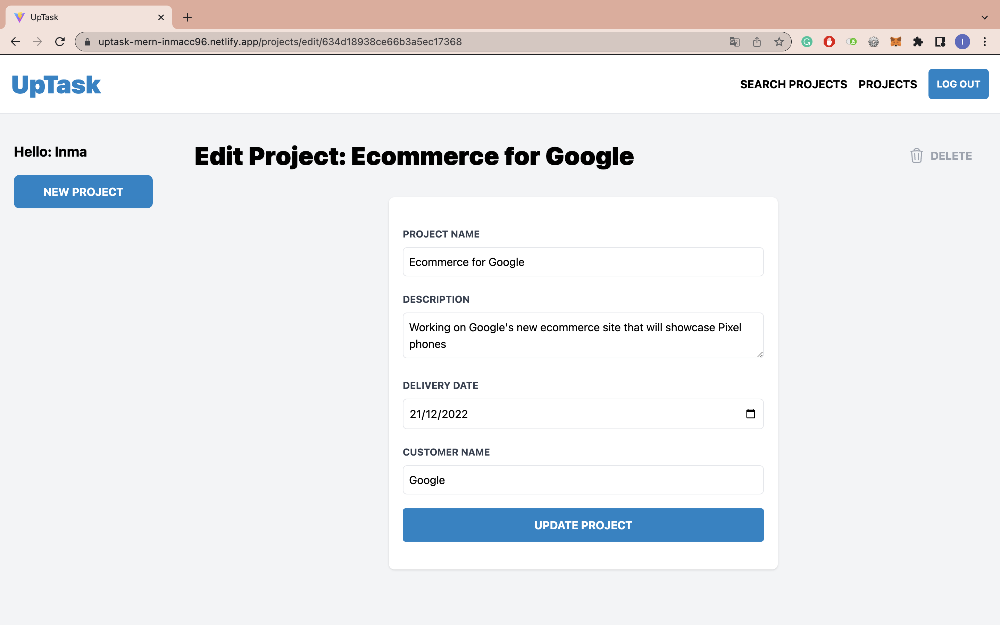
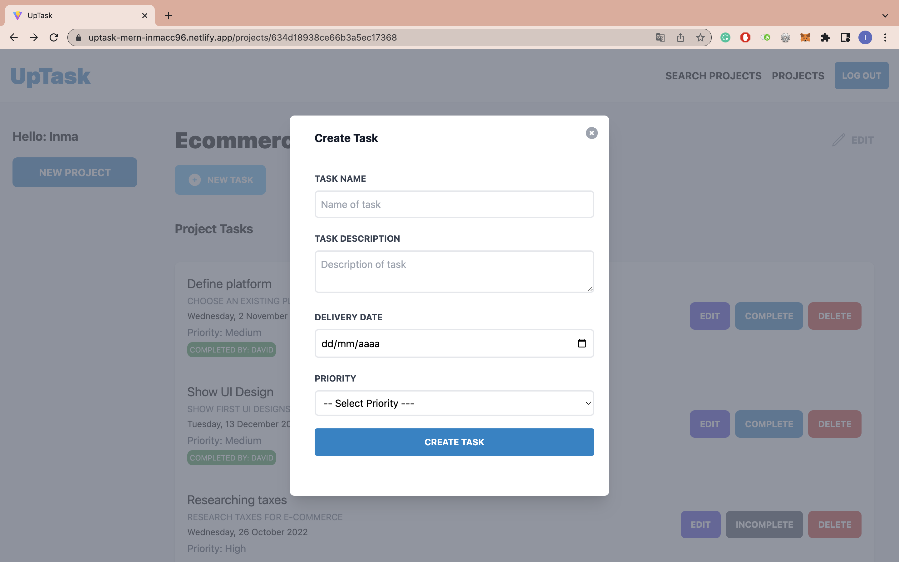

# UpTask_MERN

Fullstack application using the MERN stack. This project belongs to the [React - La Guía Completa: Hooks Context Redux MERN +15 Apps](https://www.udemy.com/course/react-de-principiante-a-experto-creando-mas-de-10-aplicaciones/) course.

## :pushpin: Table of contents

- [Introduction](#rocket-introduction)
- [Usage](#wrench-usage)
  - [Environment variables](#pagefacingup-environment-variables)
- [Built with](#hammer-built-with)
  - [Frontend](#computer-frontend)
  - [Backend](#gear-backend)
  - [Deploy](#package-deployment)
- [Links](#link-links)
- [Author](#woman-author)

## :rocket: Introduction

The application consists of two parts:

- _User authentication_. In this part you will find the login, sign up, confirm account, forget password and generate new password pages.


- _Main application_. The aim of this project is to **manage your projects and tasks**.

You can **create** a new **project** using the following form:


And all of them will appear on the **homepage**.


Within each project will appear the **related tasks** and the **collaborators** belonging to the project.


From the previous page you can **edit** and **delete** the **project** by clicking on _edit_,



**create** new **task**,



Within each task, you can **edit** it, **delete** it or **indicate** whether it is **completed** and it will automatically appear by whom,


and you can also **add partners** to the project.


> **Note**
> All these functionalities can only be realised by the creator of the project!. Collaborators will only be able to look at the tasks
> contained in the project and indicate whether the task has been completed or not.

In addition, the application contains a **project search engine**:


## :wrench: Usage

To deploy the project locally, follow these steps:

1. Clone my repository with the command `git clone https://github.com/Inmacc96/UpTask_MERN.git`.
2. Access the backend folder from a terminal and run the following commands:

- `npm install`
- `npm start`

3. Next, access the frontend folder from another terminal and run the following commands:

- `npm install`
- `npm run dev`

Finally, you will have the server at http://localhost:4000 and the client at http://locahost:3000.

### :page_facing_up: Environment variables

It is important to add the _.env_ file in the backend folder with the following content:

```
MONGO_URI = XXXX

JWT_SECRET = XXXX

FRONTEND_URL = http://localhost:3000

EMAIL_USER = XXXX
EMAIL_PASS = XXXX
EMAIL_HOST = XXXX
EMAIL_PORT = XXXX
```

where

- `MONGO_URI` is the URI of your MongoDB database,
- `JWT_SECRET` is the key to generate and decrypt your JWT,
- the `EMAIL` variables are the credentials from where you send the mails.

In addition, you should add the _.env_ file in the frontend folder with the following:

```
VITE_BACKEND_URL = http://localhost:4000
```

If in doubt, please consult the administrator.

## :hammer: Built with

### :computer: Frontend

- [react JS](https://reactjs.org/): JavaScript library used.
- [react-router-dom](https://reactrouter.com/): To build the routing system.
- [axios](https://axios-http.com/): To make HTTP requests to the server.
- [tailwindcss](https://tailwindcss.com/): CSS framework used.
- [headlessui](https://headlessui.com/): Used to add modals in the app.
- [socket.io-client](https://socket.io/docs/v4/client-api/): For the application to work in real time. If there is any change in the database, it is displayed in the application at the same time.

### :gear: Backend

- [express](https://expressjs.com/): Node.js framework used.
- [mongoose](https://mongoosejs.com/): Used to perform the queries to the MongoDB database.
- [cors](https://www.npmjs.com/package/cors): To allow our client to access the server's resources.
- [dotenv](https://www.npmjs.com/package/dotenv): To access environment variables.
- [bcrypt](https://www.npmjs.com/package/bcrypt): Used to encrypt the user's password and to check that the password entered matches the original one.
- [jsonwebtoken](https://www.npmjs.com/package/jsonwebtoken): Used for user authentication.
- [nodemailer](https://nodemailer.com/about/): To send e-mails to the user to confirm the account created or to recover the password.
- [socket.io](https://socket.io/): For the application to work in real time. If there is any change in the database, it is displayed in the application at the same time.

### :package: Deployment

- Frontend: [Netlify](https://www.netlify.com/)
- Backend: [Render](https://render.com/)

## :link: Links

- Solution URL: [https://github.com/Inmacc96/UpTask_MERN.git](https://github.com/Inmacc96/UpTask_MERN.git)
- Live Site URL: [https://uptask-mern-inmacc96.netlify.app/](https://uptask-mern-inmacc96.netlify.app/)

## :woman: Author

- GitHub - [inmacc96](https://github.com/Inmacc96)
- LinkedIn - [Inma Caballero Carrero](https://www.linkedin.com/in/inmacaballerocarrero/)
